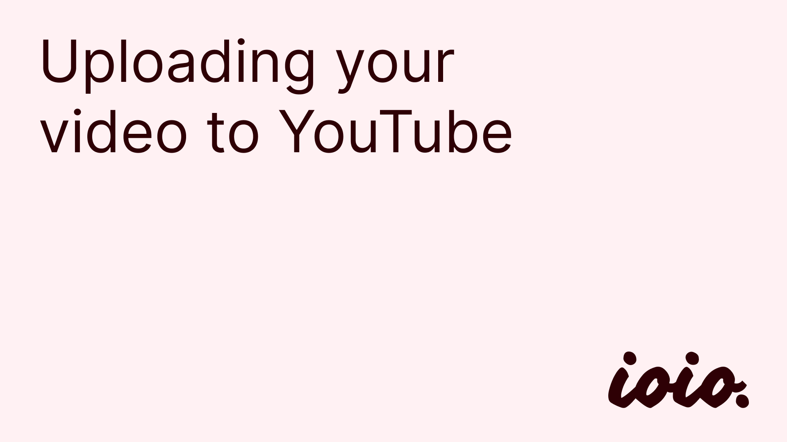
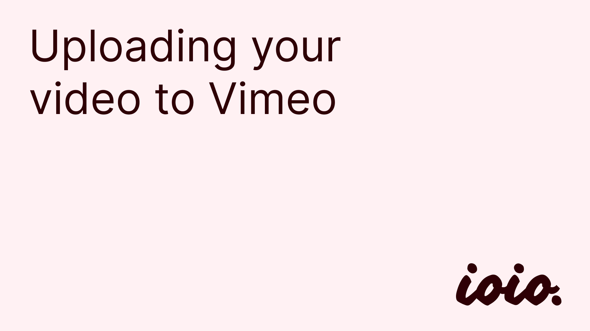

# Archive
The [Design Archive](https://ioio.uni.mau.se/archive/) is the place where student projects are showcased to internal and external stakeholders. This page contains some information that is relevant to those that are asked to provide documentation of their project.

## Preparing documentation
If your project gets selected to be showcased on the archive, you will be sent a form where you can enter all the details about your project. The information you are asked to share is as follows:

| Field  | Description |
| ------------- | ------------- |
| Cover  | Cool and/or explanatory image of the project | 
|Title | Title of the project (it can be clickbait or descriptive according to taste) |
| Creator | Name(s) and student ID(s) of the person/people involved |
| Subtitle | One-sentence explanation of the project. Our recommendation is to include the research question or context in nutshell plus more details about a specific modality or methods (e.g. "Supporting music ideation with interactive touch & stylus sketching interface") |
| Year | Year of the project|
| Lab/course | Specify if the project was done as part of lab work (e.g. IOIO) or a course (within an IxD program) |
| Technology | Main technology/platform used for the project (e.g. Arduino) |
| Keywords | Further key words characterizing the work (e.g. methodology) |

### Images and videos
Projects are best documented using images and videos. When submitting documentation, you will have the chance to upload pictures of your project. When preparing pictures, please:
- **Check for abnormal file sizes**: image files should normally not exceed 5MB each. If any of your pictures are bigger than that, consider using tools to rescale and/or compress images. If you want to compress your images, try using [this online tool](https://squoosh.app/).
- **Use a horizontal aspect ratio**: if possible, avoid uploading vertical pictures. Rather, use a square or horizontal aspect ratio. If you need a quick way to reframe your pictures you can use the photo editing functions on your phone or [Affinity Photo](https://student.mau.se/en/student-services/it-support/programmes-and-services/#accordion-92552).
- **Make sure text is legible**: if you upload a screenshot from a Figma/Miro board or similar, make sure the content of the screenshot is legible. A picture of post-it notes that can't be read is not useful for someone browsing through the archive entry.

If you want to provide videos along the text, please upload the video to YouTube or Vimeo first. You will then be able to submit a link to the video in the form. 

#### Uploading to YouTube

You can upload an unlisted video on YouTube, which means that it will only be visible from the link you will share on the form. To upload an unlisted video:
- Go to the YouTube homepage and make sure you're logged in.
- Click on `Create > Upload Video` 
- Follow the steps until you arrive at the `Visibility` section. There, make sure the video is set to `Unlisted`.
- Copy the link to the video and save it somewhere so you can submit it to the form.

#### Uploading to Vimeo

If you don't want to use YouTube, Vimeo is a good free option. To upload on Vimeo:
- Go to [https://vimeo.com/home](https://vimeo.com/home)
- Clic on `New > Upload`
- Follow the steps and enter the video information
- At the top of the page, click on `Share > Copy link`
- Save the link for later so you can add it to the form.