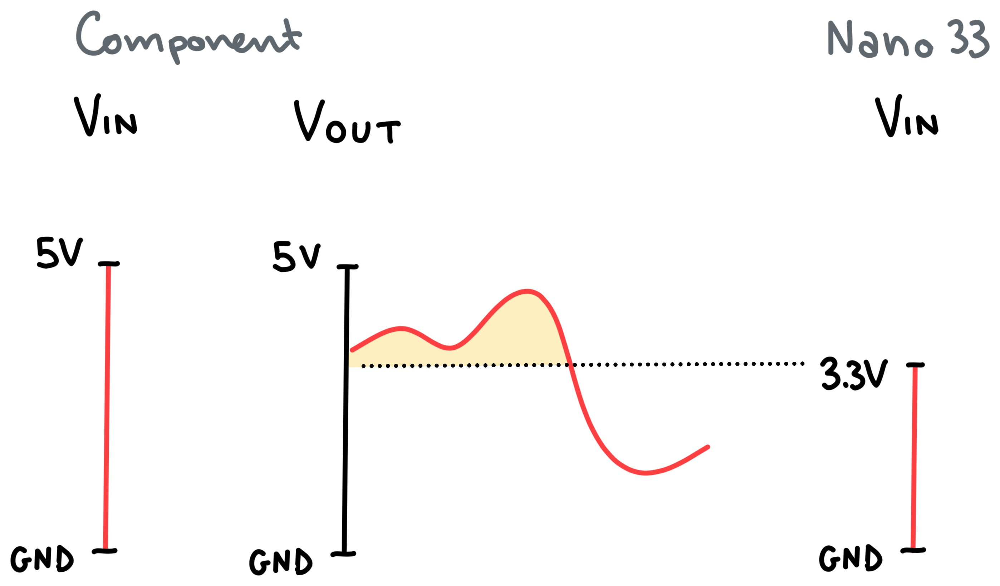
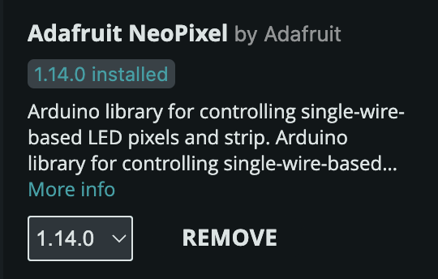

# Frequent Issues

* [5V on the Nano 33 BLE Sense Rev2](#5v-pin-on-the-nano-33-ble-sense-rev2)
* [NeoPixel](#neopixel)
* [Servo Motors](#servo-motors)
* [Standalone Arduino Setup](#standalone-arduino-setup)
* [Ardiuno and GUI interoperability](#ardiuno-and-gui-interoperability)

## 5V pin on the Nano 33 BLE Sense Rev2
Components like Servo Motors and NeoPixel rings typically require 5V to function. The Arduino Nano 33 BLE Sense Rev2 has a 5V pin that is disabled by default. To enable it, you have to solder two pads on the bottom of the silicon board. This comes with a caveat: when the 5V pin is enabled, it will only work when the Arduino Nano is powered via USB. Read more about this on the [Arduino Nano 33 tech specs page](https://docs.arduino.cc/hardware/nano-33-ble-sense-rev2/#tech-specs).

### 3.3V vs 5V logic
Using the 5V pin to power output components like a Micro Servo or a NeoPixel ring is as easy as soldering two pads. However, things can get a bit more complicated when you try to use sensors that require a 5V supply voltage. In general, a sensor that works with a supply voltage of 5V will also output signals that fluctuate between 0V and 5V. As you can see in the picture below, this can cause some issues when paired with a board that expects a signal that fluctuates between 0V and 3.3V. 

In practice, this means that when you use a 5V sensor/component you will have to scale the output to make sure it fits within the 3.3V. It is not just a matter of cutting of the signal at 3.3V though, because that would mean discarding part of the data the sensor/component is outputting (this is represented by the yellow area in the picture above). 

In preparation for situations where you need to do this, here are some helpful resources that can clear up some confusion on the topic:
- [Guide to 3V3 and 5V Power Supplies Differences](https://docs.arduino.cc/learn/microcontrollers/5v-3v3/)
- [Resistor Voltage Divider](https://electronics.stackexchange.com/a/176)
- [Voltage Divider](https://en.wikipedia.org/wiki/Voltage_divider)

## NeoPixel
Depending on the NeoPixel ring you're using, you might have to use a 5V power supply to make it work. If that's the case, refer to the section above to learn how to get 5V supply from an Arduino Nano 33 BLE Sense.

To use a NeoPixel component, you will have to [install the Adafruit NeoPixel library](https://github.com/adafruit/Adafruit_NeoPixel). Once the library is installed, you can read more about how to use NeoPixel components in the [official NeoPixel guide](https://learn.adafruit.com/adafruit-neopixel-uberguide/the-magic-of-neopixels).

### NeoPixel Library Issues
In the past, some students have encountered issues using NeoPixel components using the latest version of the library. You know you are encountering the same issue if the example files don't work properly. To solve the issue, try downgrading the NeoPixel library to version 1.14.0 using the dropdown menu.

## Servo Motors
Read [this helpful guide](https://docs.arduino.cc/learn/electronics/servo-motors/) from Arduino to get an idea of how to work with Servo Motors. You can also find more general information about what a servo motor is [here](https://www.sparkfun.com/servos).

### 360° (Continuous Rotation) vs 180°
Some Servo Motors can spin freely around the main axis, while others are restricted to 180 degrees of rotation. You can easily assess whether a motor is a 360° or a 180° motor by gently rotating the gear. If at any point you feel like you can't rotate the Servo gear without extreme force, then you know you are dealing with a 180° servo.

But why does this matter? There is a difference in working with the two motors. To control a servo motor with an Arduino board, you use the [Servo library](https://docs.arduino.cc/libraries/servo/). When you are dealing with a continuous rotation servo, the `servo.write()` function will not determine the angle of rotation but simply the speed at which the servo will keep spinning. If you need a servo that rotates more than 180 degrees but you don't want it to rotate continuously, then you need to track the rotation with another method ([read more about this here](https://forum.arduino.cc/t/how-to-control-continuous-rotation-servo-motor-360/610983/2)).

### Plastic vs metal gear
Servos come in different sizes and gear types. Servos with plastic gears are more common and they are typically good enough for most projects. If you need to move heavy parts/objects with a servo, consider asking for a servo with metal gears. 

## Standalone Arduino Setup
[This guide on Powering Alternatives](https://docs.arduino.cc/learn/electronics/power-pins/) can be a helpful resource to understand what the alternatives are in terms of powering an Arduino board that needs to be disconnected from a computer. In general, USB power banks are recommended since they provided a regulated 5V voltage that can also be accessed in the 5V pin on the Nano 33 BLE Sense.

**NOTE**
When powering an Arduino project from one of the powering alternatives mentioned in the guide, make sure that the code doesn't rely on Serial communication to read or output data. If that's the case, the code will halt until it finds a matching serial port on a computer. If no computer is connected to the board, this will always fail and the code will never run.

## Ardiuno and GUI interoperability
There might be projects that require the use of physical components controlled with a GUI or, vice versa, a GUI that updates based on the input from physical components. For these scenarios, there are a few common options.

### Processing
The easiest method is to use [Processing](https://processing.org), a creative programming environment that in many ways resembles the way you work with Arduino. Sketches in Processing are written in Java. That shouldn't scare you or whoever decides to go with this route. Processing comes with a plethora of ready-made functions that make it easy to build an interactive sketch. 

Processing and an Arduino board can talk to each other using Serial communication. You can use the [Serial Library](https://processing.org/reference/libraries/serial/index.html) to establish a connection with an Arduino board and exchange messages. Using Serial communication you can build sketches that visualise data coming from an Arduino prototype or control a physical prototype using a GUI. You can read more about interconnecting Arduino and Processing [here](https://www.arduino.cc/education/visualization-with-arduino-and-processing/) and [here](https://learn.sparkfun.com/tutorials/connecting-arduino-to-processing/all).