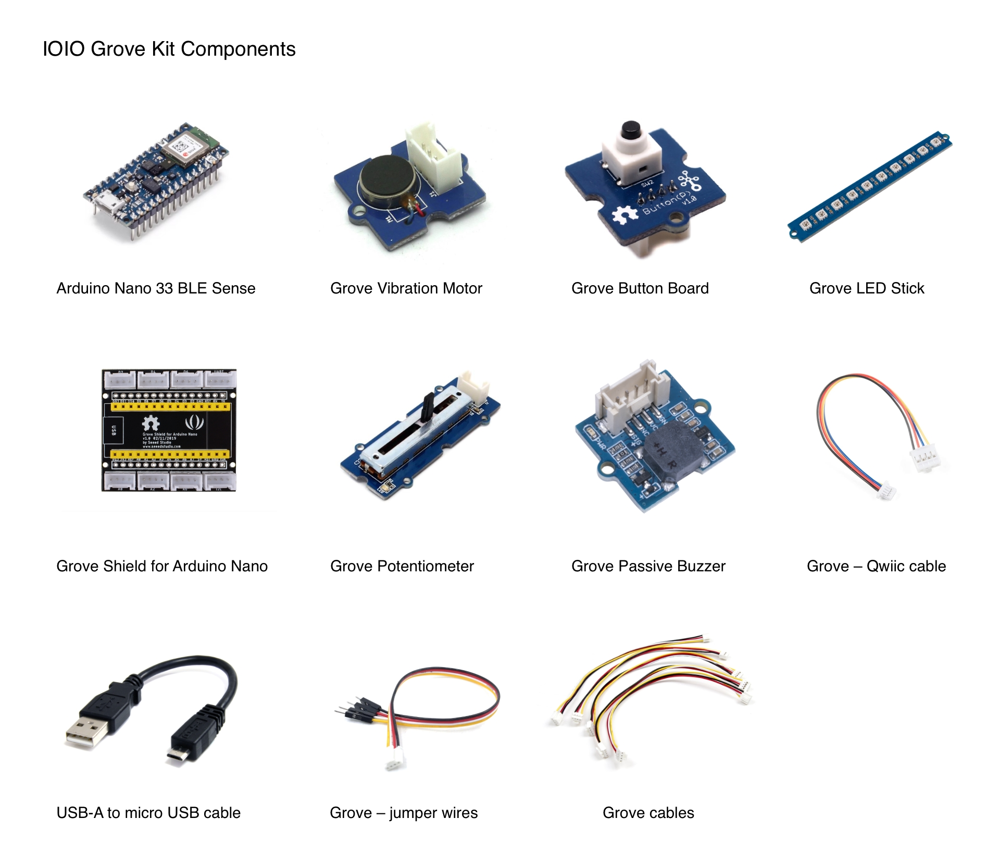
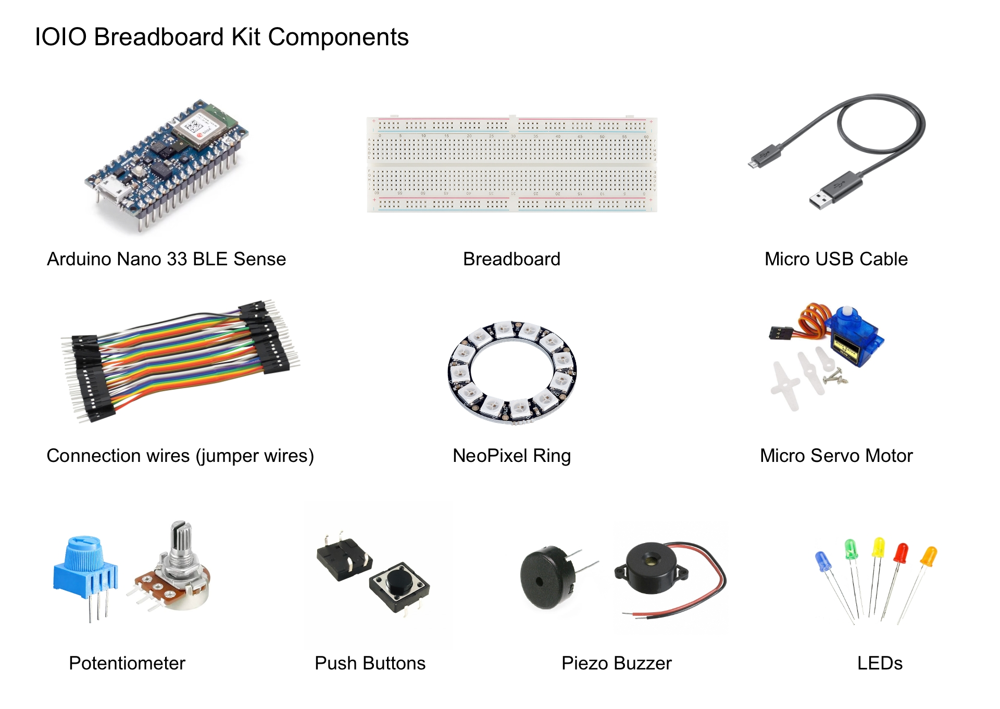
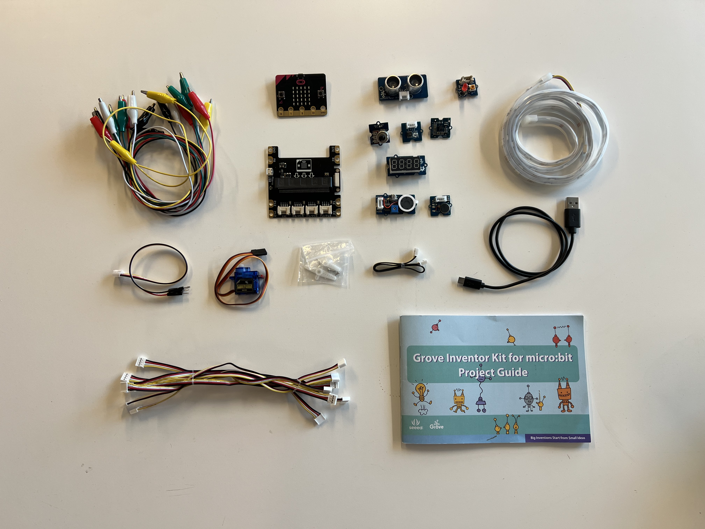

# IOIO Services

* [Lending](#lending)
  * [Kits](#kits)
    * [Grove Kit](#grove-kit)
    * [Breadboard Kit](#breadboard-kit)
    * [Micro:bit](#microbit)
* [Services for non-designers](#services-for-non-designers)

## Lending
IOIO can assist you by lending a variety of electronic components and kits that you can use to build functional prototypes. When you get kits and components from IOIO, you will be asked to provide some information that helps the lab keep track of its inventory, such as your name and your student ID. You can lend kits and components during the open hours (Wednesdays 13:00 - 16:00).

### Kits
Kits are boxes that students you borrow when you need a complete package that with commonly used components. We currently offer three kinds of kits depending on availability or what platform you've been instructed to use.

#### Grove Kit

This kit includes an Arduino Nano 33 BLE Rev2 and uses the [Grove System](https://wiki.seeedstudio.com/Grove_System/) to simplify the prototyping process. The Grove System uses a standardized connector with four wires: power, ground, data 1 and data 2. To use the system, the Arduino board is placed in a [Grove Shield](https://wiki.seeedstudio.com/Grove_Shield_for_Arduino_Nano/).

The kit consists of the following components:
- 1x Arduino Nano 33 BLE Sense
- 1x USB Cable A - micro
- 1x Grove carrier board
- 1x Button board
- 1x Potentiometer board
- 1x Vibration motor board
- 1x Passive Buzzer
- 1x Addressable LED bar
- 1x OWIIC to Grove adapter
- 1x Grove Servo cable

#### Breadboard Kit

The kit includes the following components:
- 1x Arduino Nano 33 BLE Sense Rev2
- 1x Large Breadboard
- 1x Micro USB Cable
- Connection wires (no precise amount)
- 1x NeoPixel LED ring
- 1x Micro Servo Motor
- 1x Potentiometer
- 3x Buttons
- 1x Piezo Buzzer
- x6-10 LEDs

#### Micro:bit

Micro:bit is a microcontroller developed for teaching environments by the BBC and a number of other partners. Students can use [Scratch](https://scratch.mit.edu/) (a visual programming language) to develop sketches for the Micro:bit. You can find Micro:bit learning material [here](https://makecode.microbit.org/).

## Services for non-designers